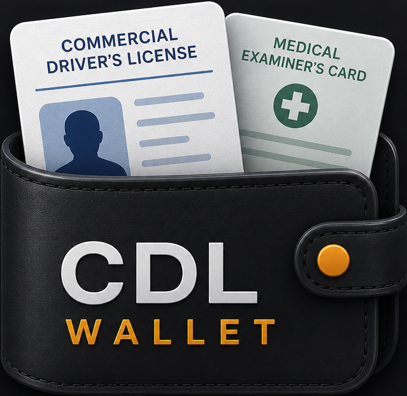
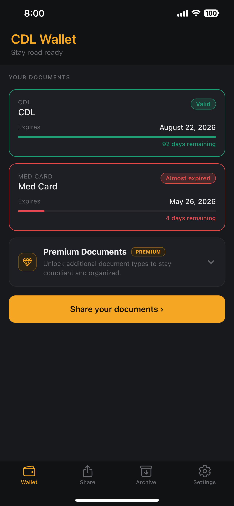
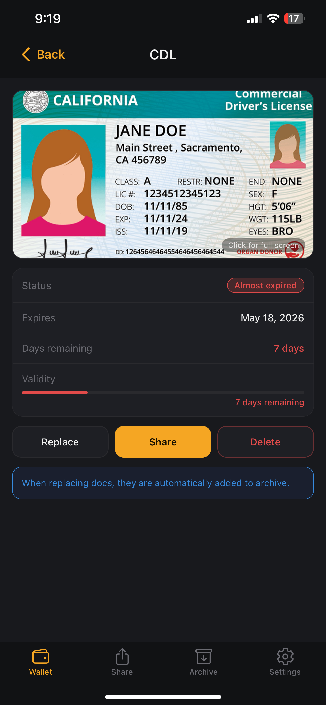
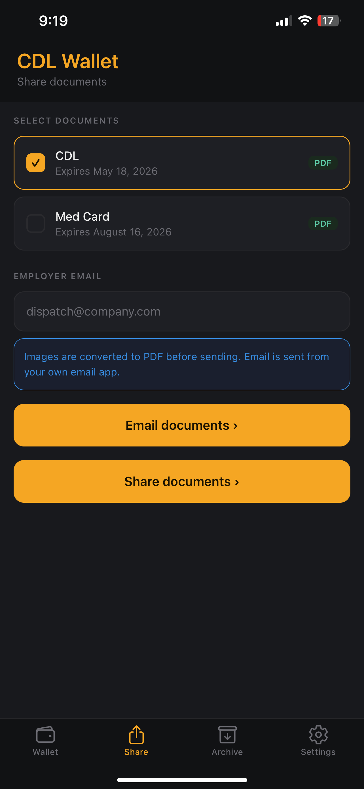
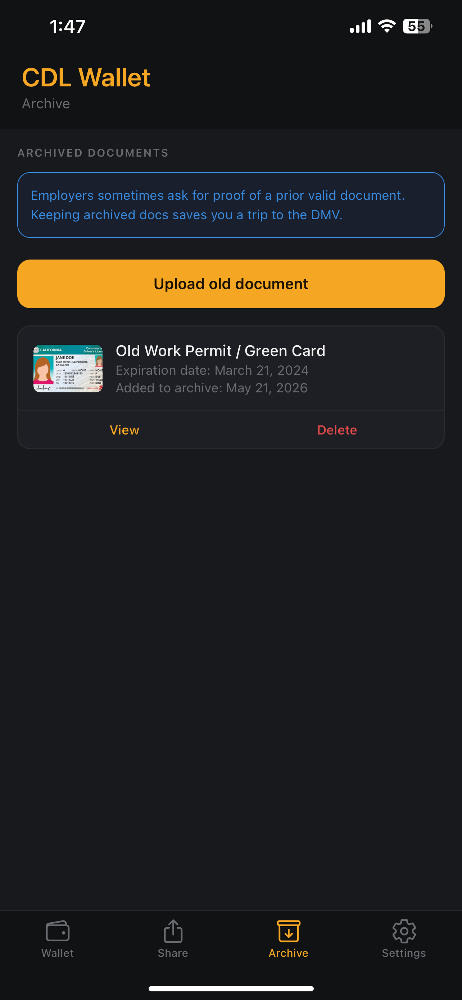
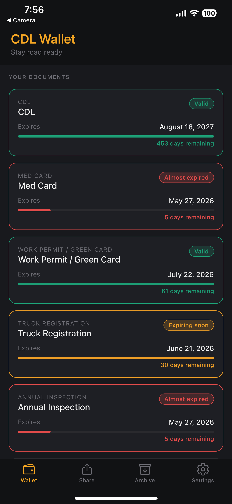
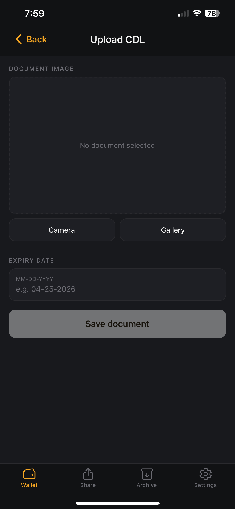

<p align="center">
  
</p>

<h1 align="center">CDL WALLET</h1>

<p align="center">
  A modern mobile app for CDL drivers to securely store, organize, track, and share important driver documents directly from their phone.
</p>

<p align="center">
  <a href="https://apps.apple.com/us/app/cdl-wallet/id6768152456">
    Download on the App Store
  </a>
</p>

---

# Overview

CDL Wallet was built to solve a real problem in the trucking industry. Many CDL drivers keep important documents scattered across their phone gallery, screenshots, text messages, or paper folders. Because of that, drivers often struggle to quickly find documents when they need them, miss expiration dates, or forget to renew important records.

The goal of CDL Wallet is to make document management simple, organized, and professional for drivers. Instead of searching through hundreds of photos, drivers can securely store everything in one place, track expiration dates, receive reminders, and quickly share documents when applying for jobs or working with carriers.

The app also helps drivers present themselves more professionally. Documents can be converted into PDF files directly inside the app and shared with employers in seconds, making the hiring process faster and more convenient.

One of the most important design decisions behind CDL Wallet was privacy. All files are stored locally on the user's device instead of external servers or cloud databases. Since CDL, medical cards, work authorization documents, and insurance records contain sensitive personal information, I wanted users to feel confident knowing their documents stay on their own device and remain under their control.

This project was fully designed and developed independently as a production-ready mobile application using React Native and Expo.

---

# Features

- Securely store CDL and medical card documents
- Premium support for:
  - Work authorization documents
  - Green cards
  - Truck registration
  - Annual inspections
  - Insurance documents
- Upload documents using camera or photo gallery
- Track expiration dates with clear status indicators
- Receive reminders before documents expire
- Share documents as automatically generated PDF files
- Archive older document versions automatically
- Face ID / biometric authentication support
- Clean modern UI optimized for mobile devices
- Multi-language support (English & Russian)
- Local-first storage design focused on privacy
- Documents remain stored directly on the user's device

---

# Tech Stack

## Mobile Development
- React Native
- Expo
- JavaScript

## Device APIs & Features
- Expo Notifications
- Expo Local Authentication
- Expo File System
- Expo Sharing
- Expo Image Picker

## Storage
- AsyncStorage
- Local device file storage

## Monetization
- RevenueCat
- Apple In-App Purchases

## Deployment
- EAS Build
- Apple App Store

---

# Screenshots

<p align="center">
  <strong>Home Screen</strong><br/>
  

  &nbsp;&nbsp;&nbsp;

  <strong>Document Viewer</strong><br/>
  

  &nbsp;&nbsp;&nbsp;

  <strong>Share Documents</strong><br/>
  
</p>

<br/>

<p align="center">
  <strong>Archive</strong><br/>
  

  &nbsp;&nbsp;&nbsp;

  <strong>Premium Features</strong><br/>
  

  &nbsp;&nbsp;&nbsp;

  <strong>Upload Documents</strong><br/>
  
</p>

---

# Why I Built This

Before building CDL Wallet, I saw firsthand how many drivers struggled to manage their documents. Important files were usually buried somewhere in their phone gallery, mixed with regular photos, screenshots, or old messages. Finding the right document quickly could become frustrating, especially during inspections, job applications, or onboarding with a new company.

Another major issue was expiration tracking. Drivers would sometimes forget to renew their CDL, medical card, or other important paperwork, which could lead to unnecessary stress or even prevent them from driving until documents were updated.

I wanted to build something simple that solved those everyday problems while also giving drivers a more professional way to manage and share their records.

Privacy was also extremely important to me while designing the app. Because these documents contain personal information, I intentionally chose a local-first approach where files remain stored on the user's device instead of being uploaded to external servers. My goal was to give users peace of mind and make the app feel trustworthy from the beginning.

This project also helped me strengthen my experience with:
- Mobile app architecture
- Native device APIs
- Authentication flows
- File handling & PDF generation
- App Store deployment
- Subscription systems
- Production debugging & release management

---

# Engineering Challenges

Some of the more interesting technical challenges included:

- Preventing biometric authentication from re-triggering continuously
- Managing local document storage efficiently
- Converting images into shareable PDF files
- Implementing expiration tracking logic
- Integrating RevenueCat with App Store subscriptions
- Designing a secure local-first storage approach
- Preparing and optimizing the app for App Store release

---

# Future Improvements

- Optional encrypted cloud backup & sync
- Additional document types
- Driver qualification file management
- Fleet/company support
- OCR scanning
- Android release

---

# Installation

```bash
git clone https://github.com/shaky1996/cdl_wallet.git

cd cdl_wallet

npm install

npx expo start
```

---

# App Store Release

CDL Wallet is officially available on the Apple App Store.

The app was fully designed, developed, tested, and deployed independently.

---

# Author

## Shakhzod Yuldashev

GitHub: https://github.com/shaky1996

LinkedIn: https://linkedin.com/in/shak-yuldashev

---

# License

This project is licensed under the MIT License.
